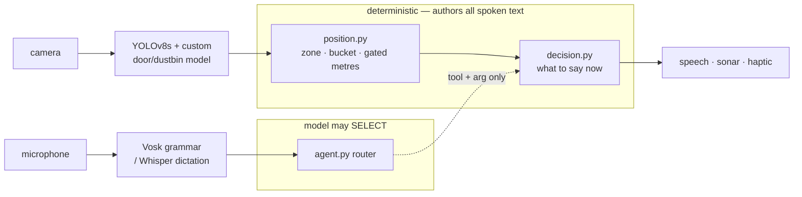
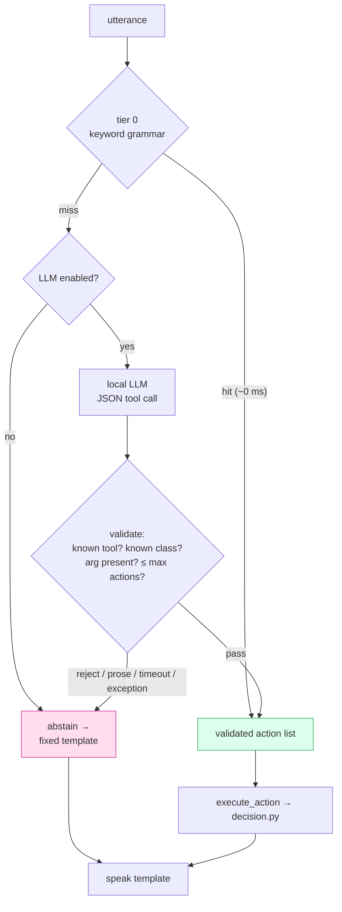

# Say Less, Never Mislead: Cross-Layer Selective Abstention in an Offline Assistive Perception System, Extended to a Tool-Mediated Voice Agent

**Status:** working draft, 2026-07-30. Results sections are **reserved** — the
routing numbers do not exist until the router runs (see `EVAL_PROTOCOL.md`,
frozen before implementation). Convert to ACM LaTeX only at submission.

**Target venue:** ASSETS Late-Breaking Work / poster. Alternates: W4A, CHI LBW.
Post an arXiv preprint on submission. **Patent note:** a preprint is a public
disclosure — `PATENT_RESEARCH.md` must be current *before* posting.

**Authors:** Aditya (add full legal name, affiliation, co-authors before
submission).

---

## Abstract

Sighted users silently discard a system's wrong answers; blind users cannot.
We report BlindAssist, an offline camera-based guidance system for blind and
low-vision users, and argue that **selective abstention** — declining to speak
when an output would be unreliable — is a first-class design objective at every
layer, not an error-handling detail. We describe five mechanisms spanning
perception (reliability-gated metric distance), planning (an openness threshold
that can answer "stop"), transport (no-data distinguished from verified-clear),
attention (proximity-gated warnings with an on-demand directional counterpart),
and dialogue: a tool-mediated voice agent in which a local offline language
model selects among fourteen deterministic capabilities and authors no guidance.
On 200 labelled utterances, deterministic-first two-tier routing improves
overall accuracy from 39.5 % to 53.0 % while keeping 100 % on trained phrasings
that an LLM-only router drops to 45.0 %, and the same model asked to answer
freely rather than to choose a tool fabricates perceptual content in 42.5 % of
responses. It also costs: out-of-scope over-triggering rises from 5.0 % to
55.0 %, which we report as a negative result about small local routers rather
than tune away.

---

## 1. Introduction

A sighted person using an assistive app performs a silent, continuous audit.
The app says "chair on your right"; they glance right; there is no chair; they
discard the claim and lose nothing. That audit loop is invisible in design
documents precisely because it is free.

For a blind user it does not exist. Every spoken claim is accepted or acted on,
because there is no cheap channel to check it against. This asymmetry inverts a
default that most interactive systems take for granted: **answer something**.
Under the asymmetry, a confidently wrong answer is not a degraded answer — it is
worse than silence, because silence costs the user one query and a wrong answer
costs them their calibration of when to trust the system at all.

This paper reports on BlindAssist, a working offline guidance system (Python
reference implementation plus an Android/Flutter port, driven by a shared
pure-logic core with mirrored test suites), and makes one architectural claim:

> Under the verification asymmetry, **selective abstention should be designed
> per layer, with layer-specific abstention criteria** — not delegated to a
> single confidence threshold at the output.

We support the claim with four mechanisms already implemented and tested in the
system (§4), and then extend it to a layer that did not previously exist in
BlindAssist: the **dialogue layer** (§5). The extension is a voice agent in
which a local, offline language model is granted authority to *select* one of
thirteen deterministic capabilities, and no authority whatsoever to *author*
spoken content. Fabricated perception is therefore prevented structurally, not
discouraged by prompt engineering.

**Contributions.**

- **C1 — A cross-layer selective-abstention pattern**, instantiated five times
  with layer-specific criteria: reliability-gated metric distance (perception),
  openness-thresholded path advice (planning), fail-safe absence-vs-negative
  (transport), proximity-gated warning suppression with a pull counterpart
  (attention), and routing abstention (dialogue, new).
- **C2 — A tool-mediated voice agent** for a safety-critical speech channel: the
  model emits only a validated `{tool, args}` pair drawn from a fixed registry;
  every *guidance* token originates in deterministic code or a fixed template,
  including clarifying questions. Conversational replies travel in a separate,
  grounded, length-capped channel that cannot reach any capability's output —
  a boundary we moved deliberately after field use and report as moved (§5.3).
- **C3 — Deterministic-first two-tier routing.** A zero-latency keyword grammar
  handles trained phrasings with no model and no network; the language model is
  consulted only on a tier-0 miss. Median routing latency stays at ~0 ms and the
  system degrades to a working subset rather than to a wrong answer.
- **C4 — A capability registry with enforced cross-site consistency.** One
  declarative table drives the ASR phrase list, the model's tool schema, and the
  executor, and emits a committed manifest that both the Python and Dart test
  suites assert against.
- **C5 — An evaluation protocol and results** for routing under paraphrase,
  multi-intent, out-of-scope, and ASR-corrupted conditions, with abstention rate
  and fabricated-perception count reported as first-class metrics rather than as
  failure modes.

---

## 2. Related work

**Deployed assistive systems.** Cloud scene-description apps (Be My Eyes AI,
Microsoft Seeing AI, Envision AI) produce rich descriptions but are
latency- and connectivity-dependent, verbose by design, and not built for
continuous walking obstacle avoidance. Dedicated wearables (OrCam MyEye) give
excellent near-field OCR and face recall at hardware cost. Spatial-audio
navigation (Microsoft Soundscape) operates at GPS/beacon granularity rather than
in-frame object localisation. Google Lookout sits closest to our object-naming
mode. Electronic travel aids (WeWALK, Sunu Band, ultrasonic canes) give
proximity without object identity or fine direction.

None of these, as far as we are aware, treats *declining to answer* as a
designed, evaluated behaviour rather than an error path. This is the gap C1
addresses.

**Monocular distance and free space.** Single-image object-distance estimation
and free-space/drivable-area segmentation are mature, and ADAS work has strong
accuracy under calibrated, fixed-camera, upright-object assumptions. Our
setting violates all three (handheld, uncalibrated, frequently truncated
objects). We therefore optimise for an *honesty policy* rather than accuracy:
§4.1 withholds the number under precisely the geometric conditions that make it
wrong in the dangerous direction.

**Non-visual output modalities.** Obstacle sonification and wearable haptic
direction belts are well established; our contribution is not the modality but
the single ordinal-localisation core that drives speech, stereo sonar, and
haptics with consistent semantics and shared anti-spam timing.

**LLM tool use and hallucination containment.** Function calling / tool use is
standard practice, and constraining a model to structured output is not novel.
What we add is the *application* of the containment argument to a channel where
the consumer cannot verify: we show that once the model's authority is reduced
to selection over a closed registry — including the selection of which fixed
clarifying question to ask — the fabricated-perception rate is not a number to
be minimised but a quantity that is zero by construction, and we report the
LLM-only ablation to show what that constraint is buying.

**Voice interfaces for accessibility.** Wake-word and command-grammar
interfaces trade coverage for accuracy. Our two-tier design (§5.2) is an attempt
to have both: the grammar keeps its accuracy and its zero latency for the
phrasings users have learned, and the open-dictation path exists only behind an
explicit trigger.

*(TODO before submission: replace this section's implicit citations with a
proper reference list; the seed list is `PATENT_RESEARCH.md` §7, extended here
with the tool-use / containment line, which that disclosure does not yet cover.)*

---

## 3. System

### 3.1 Pipeline

```
camera frame
  → object detection      YOLOv8s (COCO) + a custom door/dustbin model
  → position analysis     position.py — ordinal zone, proximity bucket,
                          gated metric distance, clock bearing
  → decision logic        decision.py — what (if anything) to say now
  → output                speech (TTS) · stereo sonar · haptic pulses
```

A parallel **input** path carries voice: offline speech recognition →
command parsing → the same decision core. §5 replaces the parsing stage of that
path with the agent layer.

### 3.2 Ordinal localisation

Each detection becomes an `ObjectInfo`: horizontal zone (left/centre/right),
vertical zone, proximity bucket (very close / close / medium / far, from box
area relative to frame area with per-class thresholds), normalised centre-x, an
optional distance in metres, and a spoken location phrase. Direction may be
spoken as thirds or as a **camera-frame clock bearing** (frame width spans
10–2 o'clock over the ~60° view), the latter being the default because
Orientation & Mobility instruction already teaches clock positions. We note in
§8 that this mapping is *not* a literal O&M bearing.

### 3.3 Pure-logic core, mirrored

All guidance logic lives in a layer with no camera, no model, and no real clock:
it takes plain bounding-box numbers and a monotonic timestamp. This layer is
implemented twice — Python reference and Dart/Flutter — with mirrored unit-test
suites (199 Python / 133 Dart tests passing as of 2026-07-30). Every spoken
string in this paper is emitted by a function in that layer and pinned by a
test that asserts the exact text.

### 3.4 Anti-spam timing

`GuidanceEngine.update(infos, now)` returns at most one message per frame under
four rules: 2-frame persistence (one-frame misdetections never speak), a 3 s
repeat cooldown, a 1.5 s minimum gap between any two messages, and an
**escalation override** — if the same obstacle's proximity bucket worsens, the
warning speaks immediately regardless of cooldown. In recorded-clip evaluation
this produced 8 announcements across 471 frames on a bedroom walkthrough with
zero phantom announcements.

### 3.5 Remote-primary architecture

On the target device (Galaxy S20 FE) on-device TFLite measured ~2.5 s per
inference for both the GPU and NNAPI delegates — the YOLOv8 head partitions
badly and every frame pays host↔accelerator copies. The system therefore
defaults to **tethered inference**: the phone ships raw YUV420 planes to a
laptop over Wi-Fi, which runs both models and returns normalised boxes, while
sonar, haptics, voice, and OCR stay native. UDP auto-discovery removes
per-session IP configuration, including the case where the phone itself is the
access point (§8).

Server compute on the tether laptop (RTX 3050 Laptop GPU, 4 GB) measures
**21.2 ms per frame** for both models at imgsz 640 (YOLOv8s 11.3 ms + custom
model 9.9 ms), median over 12 frames with warmup excluded and device
synchronisation before each stop. The same code path with `device='cpu'` under
an identical PyTorch build measures 256.5 ms — a 12× difference.

We report this history because it is a methodological caution rather than a
result. Earlier measurements of this system recorded ~750 ms per frame and
motivated an `imgsz 480` reduced-resolution mode; those were taken with a
CPU-only PyTorch build installed on a machine whose CUDA GPU sat unused, a
misconfiguration invisible from the code and absent from any log. Two
conclusions follow. First, the reduced-resolution mode is retired: at imgsz 480
the GPU saves 2 ms (19.4 ms vs 21.2 ms), so the accuracy cost buys nothing.
Half precision is likewise not adopted (20.8 ms vs 21.2 ms) — at this model
size inference is kernel-launch-bound rather than compute-bound. Second, with
model time at ~21 ms the dominant server cost is no longer detection but the
**request path**: YUV420→BGR reconstruction, rotation, and JSON serialisation.
Latency work on this architecture should target that path, not the models.

This architecture is not a novelty claim — edge offload is well known — but it
is what preserves the sub-second guidance budget the rest of the design assumes,
and it is what creates the transport-layer failure mode that §4.3 addresses.

---

## 4. Abstention mechanisms

Each subsection states the mechanism, its specific failure mode, and why
silence beats the wrong answer there. All four are implemented and covered by
named tests (§6.1).

### 4.1 Perception: reliability-gated metric distance

Distance comes from a pinhole model, `distance = real_height × F /
box_height_fraction`, with `F` the vertical focal length as a fraction of frame
height (one constant, ≈0.85 for a phone in portrait) and `real_height` from a
per-class table. The number is spoken as "about N metres" only when **three
gates** all pass:

1. **Edge-clip gate.** If the box touches the top or bottom frame edge, its
   height is truncated and the model reads *falsely far*. This is the important
   one: the error points in the dangerous direction, and it does so precisely
   for the nearest, largest objects — the ones most likely to be clipped.
2. **Confidence gate.** Below the name-confidence threshold the class may be a
   misdetection, and a wrong class means a wrong `real_height`, i.e. a
   confidently wrong number.
3. **Range gate.** Only medium/far. Up close the estimate is least reliable and
   the ordinal bucket already conveys "here".

When any gate fails, the system speaks the ordinal proximity bucket instead.
Metres are also **Find-mode only**: continuous walk warnings stay short, because
the actionable token there is the direction.

### 4.2 Planning: openness-thresholded path advice

On demand ("which way is clear?"), each of left/centre/right is scored by the
**proximity rank of its closest obstacle**, not by summed occupied area. The
naive area metric inverts under a common case — a far bulky object outweighs a
near small hazard — and steers the user *toward* the danger. Doorways are
excluded from obstacle mass (a door is the thing you walk *through*), and far
objects are ignored.

The abstention is the threshold: if even the emptiest third contains a
close obstacle, the system does not return a least-bad direction. It says
**"Stop, no clear path."** An always-answer recommender has no way to express
"none of these is acceptable", and a blind user acting on its least-bad output
walks into something.

### 4.3 Transport: fail-safe absence vs. negative

Under tethered inference a frame can fail — timeout, Wi-Fi blip, server death.
The detector returns **`null` for no-data**, never `[]`. Downstream, `[]` is not
absence; it is a *verified-clear scene*, and acting on it has three specific
consequences: sonar falls silent (silence means "path clear"), walk-mode
escalation state resets, and Find mode reports "not visible" for an object that
may be directly ahead.

On no-data the engine **pauses** guidance rather than acting, and — critically —
says so: "Connection lost, guidance paused" after five consecutive misses, and
"Guidance restored" on recovery. The system never converts its own outage into a
confident wrong answer, and it never lets a blind user mistake an outage for an
empty room.

### 4.4 Attention: proximity-gated warnings with a pull counterpart

The three mechanisms above decide whether a *particular* statement is safe to
make. This one decides how many statements the continuous channel may make at
all, and it came from the field rather than from design: on the first walk with
the complete system the user's report was *"it keeps saying all the objects,
it's too much of a cluster."*

That is the same asymmetry one level up. A sighted user ignores an over-full
notification stream at no cost. A blind user's only channel for guidance is the
one being flooded, and the cost of flooding it is not annoyance — it is that
they stop parsing it, so the one warning that mattered arrives inside noise
they have already tuned out. An unheeded warning has negative value: it spent
attention and delivered nothing.

The response was not to suppress information but to **change who initiates it**.
Walk warnings now fire only for obstacles at *close* range or nearer; the
previous rule also announced medium-range obstacles when centred. Everything
removed from the push channel is available through a pull one: a directional
query ("is there anything in front of me?", "what's on my left?") answers from
the same ordinal core with the two nearest objects in that third, closest
first. The query deliberately reports *every* detected class rather than
obstacles alone — a user who asks has, by asking, granted the attention that
the continuous channel must not assume.

Two properties make this more than a tuned threshold. The pulled answer is
generated by the same functions as the pushed warning, so the two can never
disagree — a claim a design with a separate "assistant" subsystem cannot make.
And the query is answered in **tier 0**, on the handset, with no model and no
network: the capability that compensates for a quieter safety channel does not
inherit that channel's dependencies.

### 4.5 Dialogue: routing abstention (new)

The three mechanisms above concern what the system *says about the world*. The
fourth concerns what it does when it does not understand what it was *asked*.

The keyword baseline abstains by construction — an unmatched utterance returns
nothing — but it abstains far too often, because it cannot hear paraphrases at
all (§5.1). A language-model router fixes the coverage problem and introduces a
new failure: routing an out-of-scope request ("what's the weather?", "call my
mum") to the nearest available tool, which produces a confident, well-formed,
completely irrelevant spoken answer. §5.3 describes the mechanism; §6 measures
it as **over-trigger rate**, and treats it as the safety metric of the agent
layer.

---

## 5. The agent layer

### 5.1 The problem the grammar creates

BlindAssist's offline recogniser is *grammar-constrained*: it is built with an
explicit list of ~200 phrases, and only those phrases can be transcribed at all.
This is a good trade for a small offline acoustic model — recognition accuracy
on the trained phrasings is much higher than free dictation — but it means
free-form speech is not mis-parsed, it is **never heard**. "Where's my water
bottle" does not become a bad transcript; it produces nothing. Any natural-speech
layer therefore requires an open-dictation path as a precondition, not as a
refinement.

### 5.2 Two-tier routing

```
utterance
  │
  ├─ Tier 0  keyword grammar (parse_command)      ~0 ms, no model, offline
  │            hit → action
  │            miss ↓
  └─ Tier 1  local offline LLM over the registry  → validate → action
                                                  → reject  → abstain
```

Tier 0 is the existing parser, unchanged. Tier 1 is consulted only on a miss.
Three properties follow, and all three are why the tiering exists rather than
replacing the parser outright:

- **Median routing latency stays ~0 ms.** Trained users pay nothing for the
  agent's existence.
- **The system runs with no model present.** With the LLM disabled the router
  is behaviourally identical to today's system; this is enforced by a
  regression test over every phrase in the grammar.
- **Degradation is toward fewer capabilities, never toward wrong ones.** If the
  LLM is unavailable, unmatched utterances abstain instead of being guessed at.
  This mirrors the transport rule of §4.3 one layer up.

Open dictation is opened by a **trigger word** inside the grammar (e.g.
"assistant"). Hearing it records a short window, transcribes it, and routes the
result. Tier 0 is therefore untouched by the addition — the recogniser's
constrained grammar keeps doing exactly what it does today, and only an
explicitly requested utterance takes the open path.

Transcription has two implementations, and which one runs is itself an instance
of the degradation rule. On the tether laptop the window goes to a local Whisper
model. On the handset it goes to a **second recogniser built on the same
already-loaded 40 MB model with its grammar removed** — less accurate than
Whisper, but it keeps free speech working with the laptop off and adds no
download. The transcript is passed through the local parser before the router
is consulted, because a free-form utterance frequently contains a trained
phrasing outright ("assistant, find the door"), which should never require the
network.

### 5.3 The authority boundary

The model is given a system prompt containing the tool registry (name,
one-line description, argument type) and the class enumeration once, plus a
deterministic state block (§5.4) and the utterance. It must return JSON of the
form `{"actions": [{"tool": ..., "args": {...}}]}`.

Everything after that point treats the model's output as **untrusted input**:

- Unknown tool name → reject.
- Argument not in the class enumeration (which is derived from the detector's
  own class list, so it cannot drift) → reject.
- Missing required argument, malformed on/off value, more than `max_actions`
  actions → reject.
- Prose instead of JSON, timeout, or any exception → reject.

Every rejection becomes **abstain**. And abstain does not mean the model gets to
explain itself: the clarifying question is selected from a fixed template table
by key. The model may choose *which* question is asked; it may not write one.

The result is that no *guidance* token the user hears has passed through the
language model. Guidance originates in `decision.py`/`position.py` — the same
functions, pinned by the same tests, that the touch UI calls — or in a fixed
template. This is what makes the fabricated-perception count zero by
construction rather than by measurement, and §6.5 reports the LLM-only ablation
to show what that constraint is worth.

**Where the boundary was moved, and why we report it.** The system as first
built enforced the stronger rule — *no spoken token whatsoever* originated in
the model. After the first field walk the developer-user asked for
conversation: not more capabilities, but the ability to ask a question in their
own words and be answered rather than routed. We granted exactly that and no
more. A reply now travels in a **separate channel** (`say`) that the executor
cannot route through any capability, and the split is structural rather than
prompted:

- Guidance functions are unreachable from the reply channel. Walk warnings,
  find results, distance, path advice and directional queries remain
  template-or-`decision.py` only.
- The reply is grounded in the same deterministic state block (§5.4). The
  system prompt forbids asserting presence, absence or range not present in
  that block.
- Free prose emitted *where a tool call belongs* is still discarded, so a
  chatty model does not become speech by accident; only a deliberate use of the
  reply channel is spoken.
- Replies are length-capped and truncated at a sentence boundary. A user who
  cannot skim also cannot skip, so verbosity is a safety-adjacent property, not
  a style one.
- A single flag restores the absolute rule, and that configuration is the
  ablation arm reported in §7.

We state this plainly because it weakens the strongest version of C2. The
honest formulation of the contribution is therefore: *the safety-critical
surface is closed by construction, and the conversational surface is opened
deliberately, narrowly, and measurably* — not that a language model is kept out
of the speech channel entirely. A design that refuses the second thing wholesale
is defensible on paper and was rejected by the only user we have.

An implementation constraint worth recording: the router must never raise. In
this codebase an exception thrown on the voice thread silently kills voice
recognition for the entire session — an incident that actually occurred when a
new command reached a dispatcher that did not know about it. The router
therefore catches everything and converts it to abstain.

### 5.4 Deterministic state summary

Multi-turn references ("is it still there", "the other one", "find it") need
context. Supplying that context as pixels or as free description would put
perception back inside the model. Instead the router receives a compact,
deterministic block built from the current `ObjectInfo` list and engine state:
mode and target, bearing style, visible classes with zone/proximity/count, the
last thing said, and the class names currently held in object memory.

"Is it still there" therefore resolves against the detector's own output. The
model's job is reduced to mapping an English phrase onto a tool and an argument
drawn from a closed set — a task small enough for a 1–4 B local model, which is
the point.

### 5.5 Capability registry

Fourteen capabilities exist today: walk, find, describe, count, recall, path,
**check** (the directional query of §4.4), read, clock, zones, sonar, mute,
stop, repeat. Before this work they were
declared in four places — a Python parser, its phrase list, a Python dispatcher,
and the Dart equivalents — and the sites had already drifted: the web
dispatcher silently dropped five capabilities the parser could produce.

The registry is one declarative table. It drives the recogniser's phrase list at
runtime, generates the model's tool schema, backs a single executor, and emits a
committed manifest that both language's test suites assert against. We claim
*enforced consistency across sites*, not literal single-source generation: the
field-validated parser is deliberately left in place rather than regenerated,
because the regression risk of rewriting it exceeds the value of the stronger
claim.

### 5.6 Latency handling

A local model on a CPU-only laptop is not free. Two design responses are built
in rather than tuned in later. First, the model is kept resident between
queries; a cold reload costs seconds and would land on exactly the utterance the
user cared about. Second, tier-1 entry immediately speaks a short
acknowledgement, because the speech layer is latest-wins and the real answer
simply replaces it. Unexplained silence is the specific failure this system
already designs against elsewhere — the same reasoning produced the "Still
looking for X" reminder in Find mode, after a field session where silence read
as "the app died".

### 5.7 Tiering across the network boundary

On the phone the two tiers fall on opposite sides of a Wi-Fi link, which makes
the degradation rule concrete rather than rhetorical. Tier 0 runs on the handset
against the same parser and the same registry-derived vocabulary; only an
utterance it cannot resolve is posted to the tether's `/agent` endpoint. Three
consequences:

- Every trained phrasing keeps working with the laptop switched off, so adding
  the agent introduces no new dependency for the capabilities users already
  rely on.
- The client applies the §4.3 rule verbatim: an unreachable server, a timeout, a
  non-200, or an unparseable body yields *no data* — distinct from an
  abstention, and never a synthesised action.
- The server's reply is re-validated on the client against the local registry
  before anything executes, so the closed-registry guarantee of §5.3 does not
  depend on trusting the transport. A reply containing one unusable action is
  discarded whole rather than partially executed: performing the half of a
  request that happened to parse is itself an unverified action.

---

## 6. Evaluation

Protocol and metric definitions are frozen in `EVAL_PROTOCOL.md`, and the
labelled utterance set in `eval_set.jsonl` was authored and committed **before**
the router was implemented. This ordering is deliberate: it prevents the router
from being tuned against its own test set.

### 6.1 Existing system (prior evaluation, for context)

Recorded-clip evaluation over 7 phone clips: direction accuracy 100 % of
reviewed announcement keyframes, 0 phantom announcements, 5.8 FPS / 172 ms per
frame on the development laptop, announcement latency ≈0.35–0.5 s. The known
weakness is object *naming*, not object *warning*: COCO assigns the nearest
lookalike (dustbin → "toilet", wardrobe → "refrigerator"), which is why
low-confidence warnings speak the generic word "obstacle" instead of a class
name. Gate behaviours are pinned by named tests
(`test_clipped_box_suppresses_meters`, `test_low_confidence_suppresses_meters`,
`test_meters_are_find_mode_only_not_walk`, `test_all_blocked_says_stop`,
`test_door_is_not_an_obstacle_for_path`, `test_near_small_hazard_beats_far_bulk`).

### 6.2 Routing evaluation

~200 labelled utterances across five categories — `canonical` (phrasings the
grammar already covers), `paraphrase`, `multi_intent`, `out_of_scope` (gold
label: abstain), and `ambiguous` (gold depends on a state block encoded in the
record) — evaluated under three configurations (keyword-only, LLM-only,
two-tier) and two ASR conditions (clean text, and real transcripts from
multiple speakers).

### 6.3 Metrics

Routing accuracy (exact match on the ordered action list), **over-trigger rate**
on out-of-scope input, tier-0 coverage, latency p50/p95 per stage, and
fabricated-perception count. Definitions and the fabrication detector's known
crudeness are in `EVAL_PROTOCOL.md`.

### 6.4 A capability added after the set was frozen

The `check` capability (§4.4) was implemented after `eval_set.jsonl` was
committed, which is exactly the situation a frozen set is meant to expose. Two
of the 200 records are affected, and we report them rather than re-labelling
silently:

- **par-025**, *"what is in front of me right now"*, gold `describe`. The new
  parser answers `check(ahead)`. We regard the gold label as **superseded**: the
  utterance names a direction, and the capability that did not exist when the
  label was written is the better answer to it. Scored as correct under a
  documented amendment, and as an error under the frozen labels; both numbers
  are given in §7.
- **amb-008**, *"is that thing still in front of me"*, gold `find(chair)` given
  a state block containing a chair. The new parser claims it in tier 0 as
  `check(ahead)` before the model ever sees it. It was scored wrong before the
  capability existed (the grammar abstained) and is scored wrong now, so the
  baseline number is unchanged — but the *failure mode* changed from a silent
  abstention into a confident answer to a different question. That is strictly
  worse for a blind user, and it is the predictable cost of widening a keyword
  grammar: the utterance is a referential question about a remembered object,
  exactly the case the state block and tier 1 exist for.

A third instance was caught by this run before any user met it, and is worth
reporting because it is the mechanism in miniature. The first implementation of
the directional rule treated any occurrence of "left" or "right" as a
direction, and the evaluation immediately produced
*"how much battery is left"* → `check(left)` — a new out-of-scope over-trigger
(7.5 %, up from 5.0 %). "Left" and "right" are ordinary English words; "ahead",
"front" and "forward" are not. The rule now requires a positional lead-in
("on **my** left", "check left") for the ambiguous pair and none for the
unambiguous three, which returns the baseline to 5.0 % while keeping the
capability. We report it because it is direct evidence for the paper's own
argument about keyword grammars — the same substring-collision family as the
two remaining over-triggers — and because the frozen out-of-scope category is
what surfaced it.

---

## 7. Results

All configurations are now measured. Runs come from `test_output/agent_eval_*.md`,
eval set sha256 `e4eeca83070e2d66`, model `llama3.2:3b` under Ollama on the
tether laptop (RTX 3050 Laptop, 4 GB), routing the 200-record set with the
capability registry as of 2026-08-01.

**T3 — Routing accuracy by category and configuration.**

| Category | n | keyword | LLM-only | two-tier |
|---|---|---|---|---|
| canonical | 40 | **100.0 %** (40/40) | 45.0 % (18/40) | **100.0 %** (40/40) |
| paraphrase | 70 | **0.0 %** (0/70) | **50.0 %** (35/70) | 47.1 % (33/70) |
| multi_intent | 20 | **0.0 %** (0/20) | **30.0 %** (6/20) | 10.0 % (2/20) |
| out_of_scope | 40 | **95.0 %** (38/40) | 47.5 % (19/40) | 45.0 % (18/40) |
| ambiguous | 30 | 3.3 % (1/30) | **43.3 %** (13/30) | **43.3 %** (13/30) |
| **overall** | 200 | 39.5 % (79/200) | 45.5 % (91/200) | **53.0 %** (106/200) |

Wilson 95 % CIs on the overall figures: keyword 33.0–46.4 %, LLM-only
38.7–52.4 %, two-tier 46.1–59.8 %.

Three things in this table matter more than the overall column.

**The baseline's shape is the paper's motivation stated as data.** It is perfect
on the phrasings it was designed for and *zero* on paraphrase and multi-intent —
not degraded, absent, because a grammar-constrained recogniser cannot hear what
is not in its grammar (§5.1).

**Tiering strictly dominates LLM-only, and does so exactly where it was designed
to.** LLM-only loses 55 % of the canonical category: the model mis-routes
utterances the keyword parser gets right by construction, most often by
substituting a plausible neighbour (`describe` for `count`, `walk` for `zones`).
Two-tier keeps 100 % there because those utterances never reach the model, and
still collects most of the model's paraphrase gain. This is C3 measured rather
than argued: the deterministic tier is not a latency optimisation with an
accuracy cost, it is more accurate *and* faster on the traffic it covers.

**The abstention collapse is the headline, and it is negative.** The keyword
baseline abstains on 95 % of out-of-scope input for free — an unmatched
utterance returns nothing. Both LLM configurations spend nearly all of that:
over-trigger rises from **5.0 % to 55.0 %** under two-tier. A 3 B local model
asked to choose from fourteen tools will nearly always find one it likes.
"Call my mum" becomes `read`; "what time is it" becomes `clock`; "take a photo"
becomes `walk`. Each is a confident, well-formed, completely irrelevant spoken
answer — precisely the failure §4.5 predicted, at a rate we did not predict.

We report this without mitigation because the protocol was frozen before the
router existed and tuning the prompt against this set is what the freeze
forbids. It does not falsify C1 or C2 — no run fabricated perception, and the
tier-0 abstention is intact for the traffic tier 0 covers — but it does falsify
any comfortable reading of C5 in which adding a local model is a free
improvement. The honest summary is that **coverage and abstention trade against
each other at this model size**, and that the two-tier structure is what keeps
the trade from applying to trained phrasings.

**T4 — Routing latency, p50 / p95 (ms).**

| Stage | keyword | LLM-only | two-tier |
|---|---|---|---|
| routing, tier 0 hit | < 0.01 / < 0.01 | — | < 0.01 / < 0.01 |
| routing, tier 1 hit | — | 1992 / 3110 | 1141 / 2141 |
| routing, abstention | < 0.01 | 2165 / 3141 | 1203 / 1562 |
| execution | < 0.01 | < 0.01 | < 0.01 |

Tier-0 routing was separately measured at **p50 5 µs, p95 13 µs**; the harness
rounds to milliseconds, hence "< 0.01". Tier 1 costs **1.1 s at the median and
2.1 s at p95** on the tether laptop, and two-tier's tier-1 median is
*lower* than LLM-only's because the utterances that reach the model are the
harder, longer ones only — the short canonical commands that a model answers
fastest never get there.

The practical reading: tier 1 is usable for on-demand questions and unusable
inside the continuous guidance loop. Every capability in this system is
on-demand, so the floor is survivable here — a fact about this system, not a
general result (§8).

**T5 — Out-of-scope behaviour (n = 40).**

| Configuration | abstain | wrong tool | over-trigger rate |
|---|---|---|---|
| keyword | 38 | 2 | **5.0 %** (CI 1.4–16.5 %) |
| LLM-only | 19 | 21 | **52.5 %** (CI 37.5–67.1 %) |
| two-tier | 18 | 22 | **55.0 %** (CI 39.8–69.3 %) |

Both keyword over-triggers are instructive rather than anomalous, and both are
substring collisions: *"read my email"* contains "read" and routes to the OCR
reader; *"how do i get to the bus stop"* contains "stop" and halts the current
announcement. Neither is a bug in the parser — they are the price of matching
on keywords, and they are exactly the errors a router with sentence-level
context should remove. It does not remove them: both survive into the two-tier
run, because tier 0 claims them before the model is consulted. That is the
cost side of C3 stated plainly.

**T6 — Fabricated perception.**

| Configuration | fabricating responses / n |
|---|---|
| keyword, tool-mediated | **0 / 200** (verified) |
| LLM-only, tool-mediated | **0 / 200** (verified) |
| two-tier, tool-mediated | **0 / 200** (verified) |
| same model, free text (ablation) | **85 / 200 (42.5 %)** |

This is the clearest result in the paper. The identical model, given the
identical deterministic state block and asked to *answer* rather than to
*choose a tool*, invented content in **42.5 % of responses** — and the character
of the inventions is worse than the rate suggests. Asked to "find bottle" with
a state block listing no bottle, it replied:

> *"i'm walking in front of you, my cane tapping on the ground. i've stopped
> about 6 feet away from your right side. there's a small…"*

It invents an object, a distance in feet, a bearing, and a first-person
travelling companion with a cane. For a sighted user this is a curiosity to
dismiss. For the user this system is built for it is a hazard, delivered in the
same voice, at the same volume, with the same confidence as a real detection.

The tool-mediated rows are zero **by construction, not by tuning**: the harness
checks every executed spoken string against the set `decision.py` /
`position.py` could produce for that record plus the fixed templates, and fails
loudly on anything outside it. The check ran on every routed record in every
configuration. Conversational replies (§5.3) are excluded from this count by
definition — they are model-authored by design — and were rare in these runs:
3 of 200 under LLM-only, 2 of 200 under two-tier, all on records where a tool
was expected, i.e. scored as errors rather than as fabrication.

**Figures.** F1 system diagram with the agent as a parallel input path and an
explicit perception-authority boundary; F2 two-tier router flow including the
abstain branch; F3 latency waterfall (ASR → route → execute → speak); F4
accuracy by category across the three configurations; F5 routing confusion
matrix (13 tools + abstain).

---

## 8. Discussion and limitations

**No blind-participant study.** The system has been field-walked by a single
sighted developer. Every claim in this paper about what is *safer* for a blind
user is a design argument supported by mechanism and by deterministic tests —
not by user data. An IRB-approved study with blind participants is the obvious
and necessary next step, and specifically the one that could falsify the central
premise: it is possible that users prefer a guessed answer to an abstention,
and that the over-trigger metric we optimise against is not the one that matters
to them.

**The clock mapping is camera-frame, not O&M.** Frame width spans 10–2 o'clock
over roughly a 60° field of view, so "2 o'clock" means the right frame edge
(~30°), not the literal 90° an O&M-trained traveller would turn to. A trained
user may over-rotate. This needs either relabelling or a genuine remapping
before the system claims compatibility with O&M training.

**Distance is coarse.** Roughly ±30–40 % at 5 m with an uncalibrated focal
constant. The reliability-gating argument of §4.1 does not depend on accuracy —
it is about *when* to speak a number, not how good the number is — but a
one-time per-device calibration would strengthen any accuracy claim.

**Clear-path scores box centres only.** A wide object straddling two thirds is
scored in its centre third alone. Box-extent scoring is a known fix.

**Tether dependency.** The remote-primary architecture assumes a laptop and a
local network. §4.3 makes the failure safe, not absent. On-device viability
awaits either a lighter detector head or hardware where the delegate partitions
cleanly.

**Local-model routing has a latency floor.** Tier 1 costs whatever a small
instruct model costs on the user's CPU. §5.6 mitigates the two worst cases
(cold reload, unexplained silence) but does not eliminate the floor. If the
measured floor proves too high on commodity hardware, the honest framing is that
local routing is viable for on-demand queries and not for anything inside the
continuous guidance loop — which is where all thirteen capabilities happen to
live, but that is a fact about this system, not a general result.

**The fabrication detector is keyword-based.** It flags a response naming a
detector class absent from the state block. It will miss subtler fabrication
(invented spatial relations, invented counts of a class that *is* present) and
will occasionally over-flag. Reported as a lower bound. The free-text samples
make the under-counting concrete: several flagged responses invent a distance
in feet, a bearing, and a first-person companion alongside the object, and the
detector sees only the object.

**Over-triggering is measured, not solved.** The 55 % out-of-scope
over-trigger rate under two-tier is the largest open problem this evaluation
exposes. Three directions are available and none is evaluated here, because
each would be tuning against a frozen set: an explicit rejection example set in
the prompt; a second-pass "is this in scope" classification; or a confidence
signal from the model used as an abstention gate. A held-out set would be
needed for any of them, and building one is the first item of future work.

**One model, one machine.** All routing numbers come from `llama3.2:3b` under
Ollama on a single laptop. Model size is an obvious confound for the
over-trigger result in particular. A second-model arm (`qwen3:4b`) was started
on the same frozen set and is not included here; a single alternative would in
any case be a spot check rather than a sweep.

**Chat replies are unevaluated as replies.** We count them, exclude them from
the fabrication metric by definition, and list them for inspection — but we do
not measure whether they are *correct*, useful, or well-calibrated. A user
study would have to, since they are now part of what the system says.

---

## 9. Conclusion

For users who cannot audit what a system tells them, abstention is not an error
path — it is a feature that must be designed, implemented, and measured at every
layer where the system can be wrong. We showed four such designs in a working
offline assistive system, each with criteria specific to its layer's failure
mode, and extended the pattern to a voice agent whose language model may choose
what the system does and never what it says. The interesting claim is not that
tool mediation prevents hallucination — it plainly does — but that the same
principle that motivates it also explains a distance gate, a path threshold, and
a null-versus-empty distinction three layers away.

---

## Appendix A — Capability registry (T1)

| Tool | Argument | Spoken examples | Backing function |
|---|---|---|---|
| `walk` | — | "walk mode" | `GuidanceEngine.set_mode('walk')` |
| `find` | class (required) | "find the bottle" | `set_mode('find', c)` → `decision.find_message` |
| `describe` | — | "describe the scene" | `decision.summarize_scene` |
| `count` | class (required) | "how many chairs" | `decision.count_message` |
| `recall` | class (required) | "where is my cup" | `GuidanceEngine.recall` |
| `path` | — | "which way is clear" | `decision.clear_path` |
| `check` | direction (required) | "anything on my left" | `decision.check_direction` |
| `read` | — | "read the text" | on-device OCR |
| `clock` | — | "clock mode" | `GuidanceEngine.set_clock(True)` |
| `zones` | — | "zone mode" | `GuidanceEngine.set_clock(False)` |
| `sonar` | on/off (optional) | "sonar off" | sonar controller |
| `mute` | on/off (required) | "unmute" | speech controller |
| `stop` | — | "stop" | speech controller |
| `repeat` | — | "say again" | speech controller |
| `abstain` | template key | — | fixed template table |

## Appendix B — Figure sketches (F1, F2)

**F1 — System, with the agent as a parallel input path.** The dashed boundary is
the authority claim of §5.3: nothing on the left may author text that crosses it.



**F2 — Two-tier router with the abstain branch.**



## Appendix C — Eval-set composition (T2)

| Category | n | Gold label | Purpose |
|---|---|---|---|
| `canonical` | 40 | tool | Baseline sanity — keyword config must score ~100 % |
| `paraphrase` | 70 | tool | The coverage gap the agent exists to close |
| `multi_intent` | 20 | 2 tools | Ordered action lists |
| `out_of_scope` | 40 | abstain | Carries the C1 dialogue claim |
| `ambiguous` | 30 | tool, state-dependent | Tests the deterministic state block |
